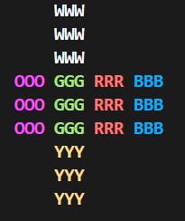

# 🧩 Rubik's Cube Solver

Welcome to the Rubik's Cube Solver! This project is a C++ implementation of Kociemba's Two-Phase Algorithm, one of the most efficient algorithms for solving a 3x3 Rubik's Cube. Let's dive in!

# 🚀 Features
### 🌈 Efficient Cube Representation
A simplified and efficient representation of the Rubik's Cube to reduce memory usage and speed up calculations.

### 🔄 Basic Cube Moves
The solver supports all fundamental moves:

Face Rotations: U (Up), D (Down), L (Left), R (Right), F (Front), B (Back)
Inverses: U', D', L', R', F', B'
Double Moves: U2, D2, L2, R2, F2, B2

### 🧠 Advanced Search Algorithm
The solver uses IDA* (Iterative Deepening A*) search, which enables efficient exploration of the solution space and helps achieve quick solutions.

